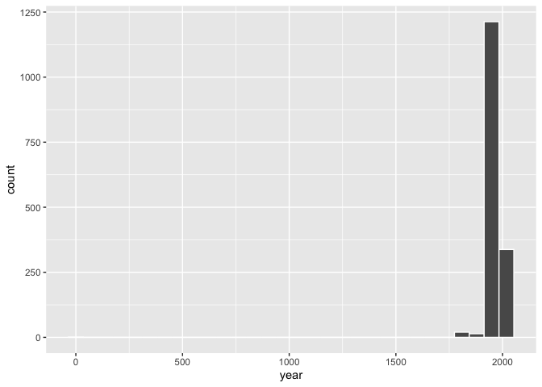
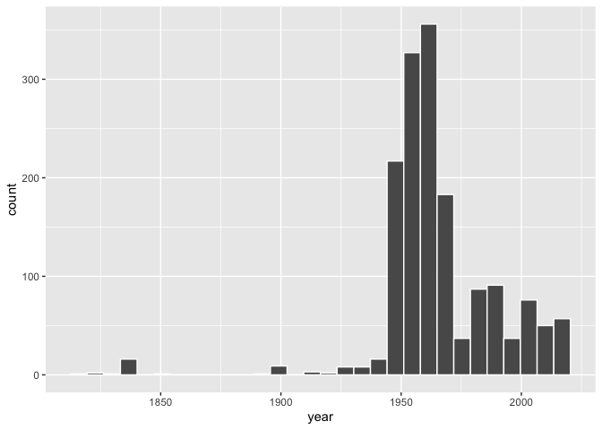

lab-08 pt.2
================
Conor Lacey
2023-03-05

``` r
suppressWarnings(library(tidyverse))
```

    ## ── Attaching packages ─────────────────────────────────────── tidyverse 1.3.2 ──
    ## ✔ ggplot2 3.4.0     ✔ purrr   0.3.4
    ## ✔ tibble  3.1.8     ✔ dplyr   1.0.8
    ## ✔ tidyr   1.1.4     ✔ stringr 1.4.0
    ## ✔ readr   2.1.3     ✔ forcats 0.5.1
    ## ── Conflicts ────────────────────────────────────────── tidyverse_conflicts() ──
    ## ✖ dplyr::filter() masks stats::filter()
    ## ✖ dplyr::lag()    masks stats::lag()

``` r
library(skimr)
```

    ## Warning: package 'skimr' was built under R version 4.1.2

### Introduction

I made a separate markdown document so that I didn’t have to wait 3
minutes every time I wanted to load my knitted document.

### Exercise 10

``` r
uoe_art <- read_csv("data/uoe-art.csv")
```

    ## Rows: 3017 Columns: 3
    ## ── Column specification ────────────────────────────────────────────────────────
    ## Delimiter: ","
    ## chr (3): title, name, link
    ## 
    ## ℹ Use `spec()` to retrieve the full column specification for this data.
    ## ℹ Specify the column types or set `show_col_types = FALSE` to quiet this message.

``` r
uoe_art <- uoe_art %>%
  separate(title, into = c("title", "date"), sep = "\\(") %>%
  mutate(year = str_remove(date, "\\)") %>% as.numeric()) %>%
  select(title, name, year, link)
```

    ## Warning: Expected 2 pieces. Additional pieces discarded in 39 rows [121, 179,
    ## 292, 323, 460, 466, 510, 536, 556, 601, 666, 758, 830, 1085, 1171, 1368, 1397,
    ## 1737, 1762, 1865, ...].

    ## Warning: Expected 2 pieces. Missing pieces filled with `NA` in 650 rows [2, 10,
    ## 12, 13, 18, 21, 25, 27, 31, 32, 37, 42, 44, 68, 73, 87, 94, 97, 106, 107, ...].

    ## Warning in str_remove(date, "\\)") %>% as.numeric(): NAs introduced by coercion

Yes we have some warnings, because some titles don’t have a year in
parenthesis! As a result, we will have an NA in quite a few rows for the
year column.

### Exercise 11

``` r
skim(uoe_art)
```

|                                                  |         |
|:-------------------------------------------------|:--------|
| Name                                             | uoe_art |
| Number of rows                                   | 3017    |
| Number of columns                                | 4       |
| \_\_\_\_\_\_\_\_\_\_\_\_\_\_\_\_\_\_\_\_\_\_\_   |         |
| Column type frequency:                           |         |
| character                                        | 3       |
| numeric                                          | 1       |
| \_\_\_\_\_\_\_\_\_\_\_\_\_\_\_\_\_\_\_\_\_\_\_\_ |         |
| Group variables                                  | None    |

Data summary

**Variable type: character**

| skim_variable | n_missing | complete_rate | min | max | empty | n_unique | whitespace |
|:--------------|----------:|--------------:|----:|----:|------:|---------:|-----------:|
| title         |         1 |          1.00 |   0 |  95 |     8 |     1388 |          0 |
| name          |       115 |          0.96 |   2 |  55 |     0 |     1116 |          0 |
| link          |         0 |          1.00 |  53 |  56 |     0 |     3017 |          0 |

**Variable type: numeric**

| skim_variable | n_missing | complete_rate |    mean |    sd |  p0 |  p25 |  p50 |  p75 | p100 | hist  |
|:--------------|----------:|--------------:|--------:|------:|----:|-----:|-----:|-----:|-----:|:------|
| year          |      1431 |          0.53 | 1964.38 | 55.47 |   2 | 1953 | 1962 | 1979 | 2020 | ▁▁▁▁▇ |

There are 115 pieces with artist info missing

### Exercise 12

``` r
uoe_art %>% ggplot(aes(x = year)) +
  geom_histogram(color = "white")
```

    ## `stat_bin()` using `bins = 30`. Pick better value with `binwidth`.

    ## Warning: Removed 1431 rows containing non-finite values (`stat_bin()`).

<!-- -->

Strange. There it appears there a piece of art that was created around
the time Christ was born. Well, clearly this must be an issue. Let’s go
take a look.

### Exercise 13

``` r
uoe_art %>% filter(year <  500)
```

    ## # A tibble: 1 × 4
    ##   title         name          year link                                         
    ##   <chr>         <chr>        <dbl> <chr>                                        
    ## 1 "Death Mask " H. Dempshall     2 https://collections.ed.ac.uk/record/21649?hi…

When we go to this artwork’s page we find that it was actually done in
1964. Let’s fix this.

``` r
uoe_art<-uoe_art %>% mutate(year = if_else(year == 2, 1964, year)
                              )

uoe_art %>% ggplot(aes(x = year)) +
  geom_histogram(color = "white")
```

    ## `stat_bin()` using `bins = 30`. Pick better value with `binwidth`.

    ## Warning: Removed 1431 rows containing non-finite values (`stat_bin()`).

<!-- -->

### Exercise 14

``` r
uoe_art %>% count(name) %>% arrange(desc(n)) %>% head(10)
```

    ## # A tibble: 10 × 2
    ##    name                 n
    ##    <chr>            <int>
    ##  1 Unknown            357
    ##  2 Emma Gillies       177
    ##  3 <NA>               115
    ##  4 John Bellany        22
    ##  5 Ann F Ward          19
    ##  6 Boris Bućan         17
    ##  7 Marjorie Wallace    17
    ##  8 Zygmunt Bukowski    17
    ##  9 Gordon Bryce        16
    ## 10 William Gillon      16

It appears most of their pieces are by Emma Gillies. I have no idea who
this is because I’m a quant psych shut-in. It looks like, from a quick
Wiki search, that she is famous for her Art Deco style? Sure! If
anything this just reflects my knowledge of the art world and how
uncultured I am.

### Exercise 15

``` r
uoe_art %>% filter(str_detect(uoe_art$title,"child") | str_detect(uoe_art$title,"Child")) %>% nrow()
```

    ## [1] 11

It appears there are 11 pieces that contain the word “child” or “Child”.
